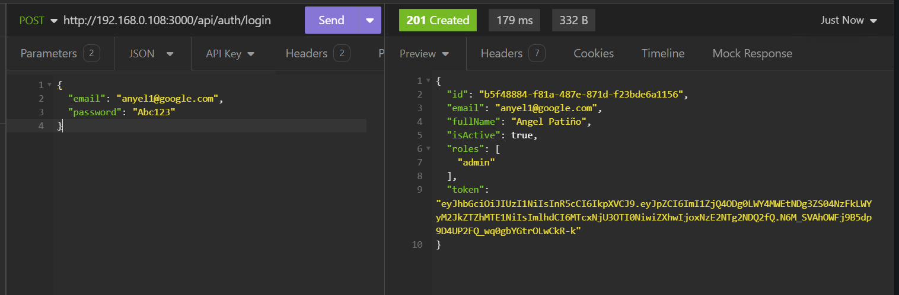
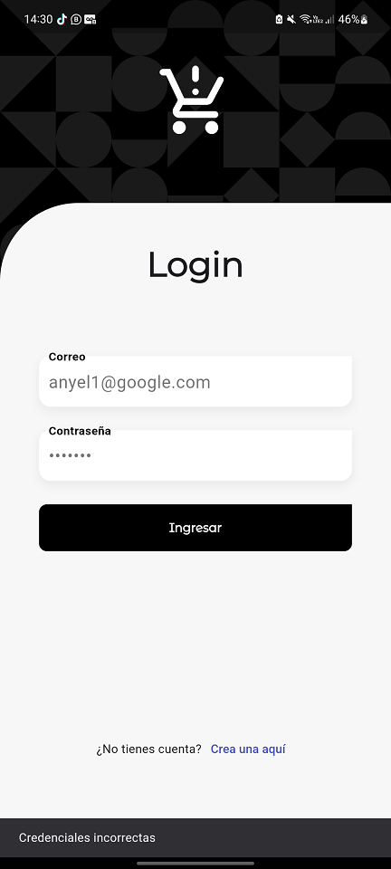
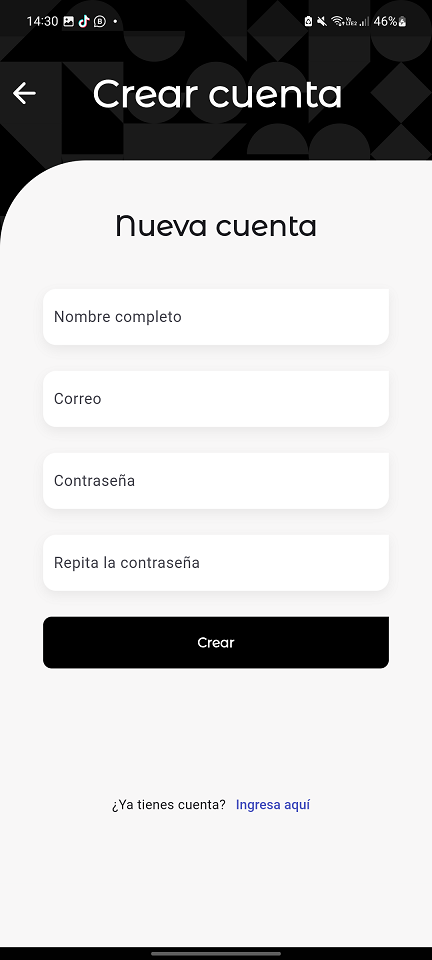

## RESULTS
### API to Login User
 
### Login
 
### Register
 

# Flutter - Authenticated CRUD App - TesloShop

Este es un proyecto para trabajar con:

* Cámara
* Tokens de acceso
* CRUD (Create Read Update Delete) Rest API Endpoints
* Riverpod
* GoRouter

## El backend lo pueden obtener de aquí

[Teslo Backend - Nest RestServer](https://hub.docker.com/repository/docker/klerith/flutter-backend-teslo-shop/general)

# Importante
Recuerden leer y seguir la guía para montar el backend localmente.

